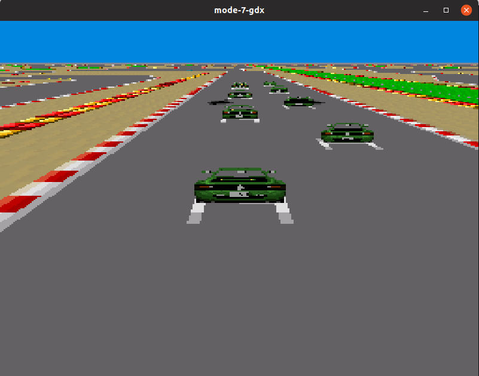

mode-7-gdx
======

LibGDX based mode 7 engine

* Gradle
* LibGDX 1.9.10

# Run

Desktop
```
gradle desktop:run
```



For android
```
keytool -genkey -v -keystore ~/.android/debug.keystore -storepass android -alias androiddebugkey -keypass android -keyalg RSA -keysize 2048 -validity 10000
gradle android:build
gradle android:run
```

http://en.wikipedia.org/wiki/Mode_7